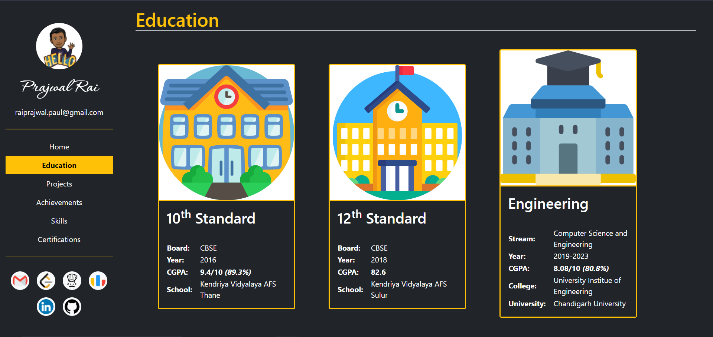
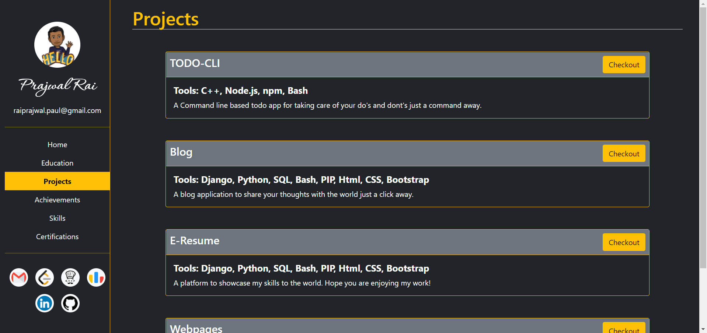
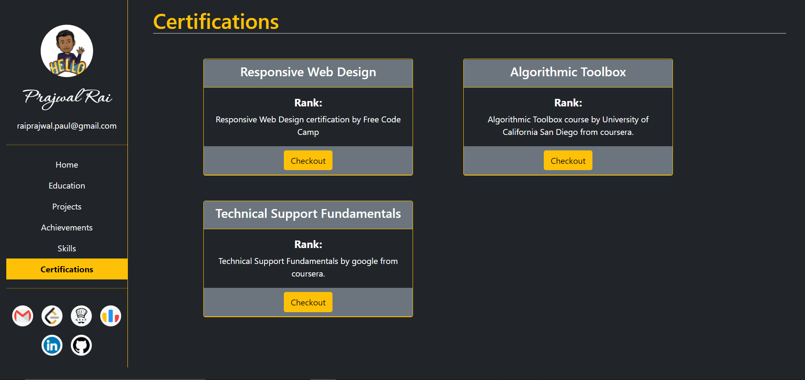

# Resume Website [(Checkout)](https://prajwal-rai-e-resume.herokuapp.com/)

### This is a personal project and contains information regarding my professional career

#### Here is a glimpse of it:

1. Home Page:

    

2. Education Page:

    

3. Projects Page:

    

4. Achievemenents Page:

    

5. Skills Page:

    

6. Certifications Page:

    

7. Admin Panel:

    

6. Certifications Table:

    

6. Projects Table:

    

6. Achievemenents Table:

    

Hope you like my profile. Suggestions are welcome.
